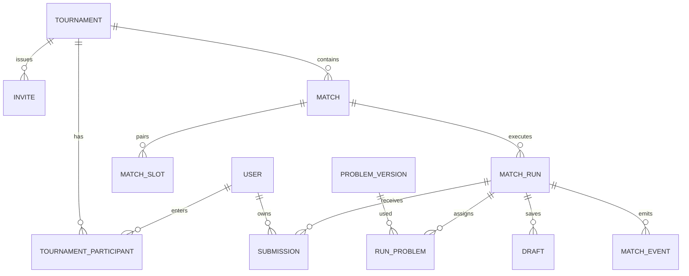

# Модель данных

Целевая модель Django ORM/SQLite. UUID — внешние ID, timestamps UTC, длительность целыми миллисекундами/секундами. Пользовательские ID не заменяют object-level access checks. Чувствительные поля сериализуются только явным private serializer.

| Сущность | Основные поля / смысл |
|---|---|
| User | id, displayName, normalizedEmail unique, passwordHash, role participant/admin, isActive. Custom Django User с первой миграции. |
| Tournament | id, slug unique, title, description, startsAt/endsAt, format single_elimination, participantLimit, visibility public/unlisted, будущий `shareTokenHash` для unlisted-доступа, status, createdBy, defaultMatchConfig, activeParticipantCount, rosterFrozenAt, createdAt/updatedAt. A1-03.1 сохраняет остальные перечисленные поля; выдача share token ещё не реализована. `activeParticipantCount` обновляется атомарно вместе с roster mutations; `rosterFrozenAt` выставляется во внешней транзакции bracket generation. |
| TournamentParticipant | UUID id, tournamentId, userId, seed nullable positive integer, status ACTIVE/REMOVED, addedAt/removedAt. Unique tournament/user; active non-null seeds are unique within the tournament. Removal is logical and match references preserve the entrant. |
| Invite | id, tournamentId, tokenHash unique, expiresAt или maxUses (минимум одно), usedCount, revokedAt, createdBy. Plain token отдаётся при создании, не хранится. |
| InviteAcceptance | inviteId/userId unique, acceptedAt. Идемпотентный accept, повтор не расходует use. |
| ProblemPackage | id, checksum, formatVersion, importedAt/by, validationStatus, privateStorageRef. Формат берётся из фактического README пакета. |
| ProblemVersion | id, packageId, localKey, source metadata, statementMarkdown, publicAssetRefs, limits, privateTestRefs/checkerRef/validatorRef/referenceRef, readiness. Версия фиксируется в run. |
| Language | serverId, displayName, compilerImage digest/tag, fixed compile/run argv, sourceFilename, template, enabled. Browser не задаёт executable/image. |
| Match | tournamentId, roundIndex, position, slot0/slot1, nextMatchId/nextSlot, currentRunId, winnerId nullable, status. Unique tournament/round/position. |
| MatchSlot | matchId, index 0/1, participantId nullable, upstreamMatchId nullable, resolution PLAYER/BYE/WAITING. Unique match/index. |
| MatchRun | matchId, sequence, status, startedAt, pausedAt, accumulatedPauseMs, allowedDurationMs, scoreRule snapshot, finishedAt, winnerId, technicalReason, revision. Unique match/sequence; один current run. |
| RunProblem | runId, problemVersionId, label A/B/…, ordinal. Unique run/problem и run/label. Один набор для обоих игроков. |
| ParticipantRunState | runId, userId, ready, solvedCount, penaltyMs, lastAcceptedElapsedMs. Unique run/user. Производная проекция из eligible submissions. |
| Submission | id, runId, userId, problemVersionId, languageId, source, sourceHash, idempotencyKey, receivedAt, elapsedMs, processStatus, verdict nullable, attempts, availableAt, leaseToken/leaseUntil, bounded diagnostics/metrics. |
| Draft | userId/runId/problemVersionId/languageId unique, source, revision, updatedAt. Отдельные языки не затирают код друг друга. |
| MatchEvent | integer eventId монотонный, tournamentId, matchId/runId nullable, type, occurredAt, publicPayload allowlist. Private исходники не хранятся в publicPayload. |
| AdminAction | actorId, tournamentId, matchId/runId, action, reason, before/after refs, timestamp. Изменения фиксируются без копирования секретов/source. |

Session/cookie storage использует стандартную Django session модель; настройки безопасного cookie и CSRF обязательны.

## Обязательные ограничения

- `users.role` имеет только participant/admin, default participant. `is_staff`/`is_superuser` не назначаются из регистрации.
- Назначается только активный `participant`, не admin. Активных игроков не больше cap; добавление/accept атомарно обновляет их число. Seed — положительное целое и уникален среди active entrants, если задан; один игрок не попадает дважды в раунд.
- Изменения состава отклоняются после `rosterFrozenAt`. `freeze_roster(tournament_id)` идемпотентен и вызывается внутри транзакции генерации bracket; ошибка создания bracket откатывает freeze.
- Пары и набор задач нельзя незаметно менять после старта. Run хранит immutable версии задачи/правил.
- Unique `(userId, runId, idempotencyKey)` связывает повторный submission request с одним объектом; при том же ключе и другом source/language/problem возвращается 409.
- Worker claim/recovery guarded by status и leaseToken. Старый worker не перезаписывает новый результат.
- Winner в downstream slot записывается только один раз по resolved upstream match; повторный callback не создаёт новый слот/матч.
- Verdict может быть null до завершения; инфраструктурный сбой не хранится как RE участника.
- Случайные invite/share tokens хранятся хешами. Role/draft/source/email не входят в public snapshot.

## Миграции и жизненный цикл

Агент 1 создаёт custom User и исходные settings. Каждая app имеет собственную последовательность Django migrations с явными зависимостями. При интеграции проверяется миграция с нуля и отсутствие нескольких leaf migrations одной app. SQLite не обеспечивает row locking через `select_for_update`; использовать atomic transactions, уникальные constraints и conditional update.

Source и official data живут в private persistent storage. Purge можно выполнять после demo по отдельной политике; до окончания турнира/аудита посылки не теряются. Public asset storage отделяется от private: web proxy не обслуживает весь uploads/data каталог. Для backup использовать SQLite online backup/checkpoint при остановленных writer или подтверждённый штатный способ, не копирование одного занятого файла без WAL.
