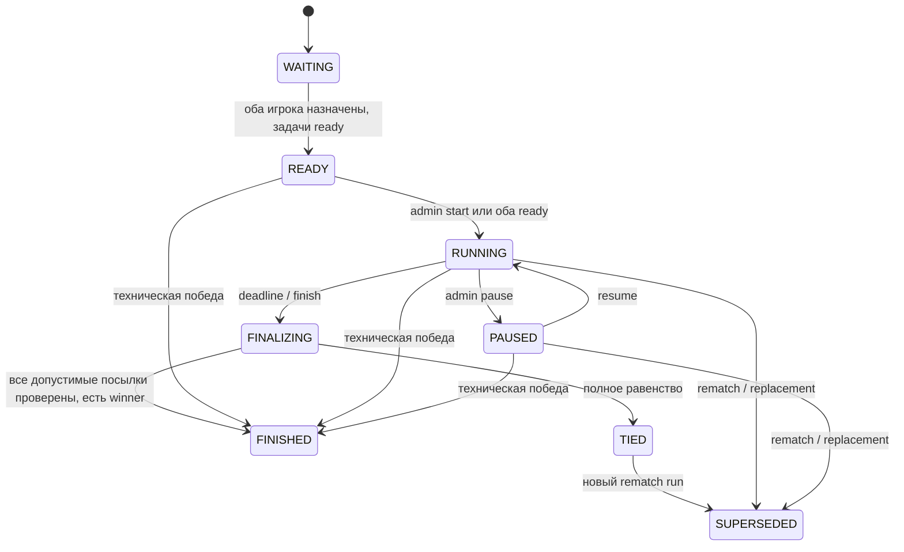

# Сетка, часы и результат матча

Этот документ задаёт доменные правила для агента 2 и contract допуска посылок для агента 3. Ни browser timer, ни задержка judge не определяют официальное время решения.

## Турнирная сетка

Один турнир — single elimination. Агент 2 создаёт сетку внутри `transaction.atomic()` и в той же транзакции вызывает принадлежащий агенту 1 сервис `backend.apps.tournaments.services.freeze_roster(tournament_id)`. Сервис устанавливает `rosterFrozenAt`, идемпотентно возвращает один и тот же активный состав и отклоняет турнир с менее чем двумя активными участниками. Если проверка или генерация сетки завершается ошибкой, общий rollback снимает и freeze. Состав нельзя менять отдельной операцией между freeze и созданием матчей.

Сервис freeze возвращает active roster в каноническом порядке: заданный seed по возрастанию, `null` seed в конце, затем `userId` по возрастанию. Агент 2 использует этот порядок при построении ближайшей степени двойки; freeze не придумывает и не сохраняет отсутствующий seed. Дублирующий seed запрещён до генерации. Пустой слот маркируется BYE, участник проходит без запуска фиктивного матча. Слот из будущего матча — WAITING, его нельзя принять за bye. Ошибка генерации после rollback оставляет состав редактируемым и допускает повторную попытку.

Каждый match имеет два слота, round/position и связь `nextMatchId/nextSlot`. Match с bye разрешается как bracket state; для настоящего матча создаётся MatchRun. Парные правки до старта валидируются по всему раунду. Повторная генерация требует явного reset только для ещё не начатой сетки и не создаёт дубликатов.

## Состояния run

Техническое завершение может быть выполнено и из FINALIZING/TIED. Оно явно фиксирует reason/actor и исключает дальнейшее изменение счёта поздними результатами этого run. UI показывает technical, а не выдаёт его за обычную победу.

## Часы и допуск

Активное время = `(now - startedAt) - accumulatedPause - currentPauseDuration`. Deadline определяется `allowedDurationMs`; extension увеличивает duration. Сравнение выполняет сервер. Submit разрешён только при RUNNING и `elapsedMs < allowedDurationMs`. Точное equality относится к закрытому времени.

Сохранить server receivedAt/elapsedMs вместе с submission до 202. При timeout закрыть новые submissions и перейти в FINALIZING. Посылка, сохранённая до deadline, учитывается, даже если реальная проверка завершится после. При смене состояний учитывать короткую транзакцию допуска/создания submission; не оставлять гонку «match finished между проверкой и записью».

Пауза запрещает новые посылки. Уже принятую очередь можно продолжить проверять; scoring использует исходное active elapsed. Сетевые часы frontend показывают serverNow/elapsed, но не меняют допуск. Автостарт по готовности вызывается из идемпотентного domain service, и имеет те же проверки, что admin start. Отдельный лёгкий match-clock management process проверяет истечение времени короткими ticks; долгий judge runtime не блокирует clock reconciliation. API/ResultService дополнительно применяют то же идемпотентное правило при операции, не полагаясь на точность частоты tick.

## Правила результата

Предлагаемый фиксируемый перед run конфиг:

1. Больше уникальных задач с первым OK.
2. При равенстве — меньше penalty: сумма active elapsed первых OK плюс `wrongAttemptPenaltyMs × penalizedAttemptsBeforeFirstOK` по решённым задачам.
3. При равенстве — меньше active time последнего первого OK.
4. Если полностью одинаково или оба ничего не решили — TIED и rematch по опубликованному правилу.

Admin выбирает коэффициент штрафа и набор penalized verdicts; рекомендуемый набор WA/TL/ML/RE, без CE. Не выдавать это за требование кейса: кейс требует заданное правило и явный tie-break, а конкретные числа выбирает команда. Параметры видны обоим до старта и immutable внутри run.

Repeated OK по уже решённой задаче не добавляет solved/штраф. Infrastructure error, draft и custom-input run не влияют на score. Дубликат результата игнорируется по submission ID/lease. Невыполненные результаты не считаются поражением из-за длительной очереди.

Winner записывается вместе с final state и downstream slot/event в одной транзакции с guards. FINALIZING может долго ждать инфраструктуру: показать понятный статус и дать admin действие, сохранив submission. Не назначать случайную победу по времени ответа judge.

## Ручные действия

| Действие | Правило |
|---|---|
| Pause/resume | Только RUNNING/PAUSED, сохраняет active clock, пишет actor/reason/event. |
| Extension | RUNNING/PAUSED; positive bounded seconds, видно обоим; повтор защищён command idempotency key. |
| Technical result | Выбирается один действующий игрок; reason обязателен; поздние результаты сохраняются в истории, но не меняют winner. |
| Rematch | Создаётся новый MatchRun sequence, старый SUPERSEDED/сохранён; отдельные drafts/submissions и clocks. |
| Replacement | До старта меняет слот; во время игры только abort старого и новый run, не переносит чужой score. Новый аккаунт имеет participant роль. |

Если downstream match уже начался, пересмотр предшествующего результата отклоняется с 409. Массовый rollback раундов выходит за MVP. До старта downstream можно очистить ранее заполненный слот и выполнить переигровку с аудируемым действием. Удаление/замена не уничтожает историю уже принятых посылок.
