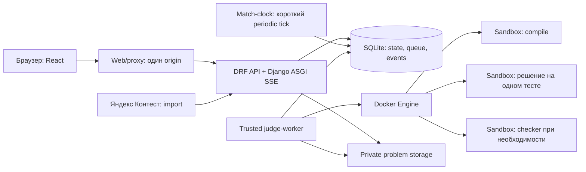

# Компоненты и границы системы

Командный стек: Django REST Framework, React, SQLite3. Для MVP предлагается один Django-проект с разделением ответственности на apps, один worker и собственная Docker-песочница. Backend/common/accounts/tournaments уже integrated (PR #2/#5/#8); остальные компоненты — цель. Фактический снимок в context/STATE.md.

API сохраняет посылку и возвращает 202, worker получает её из базы и реально исполняет. Worker сохраняет verdict через доменный сервис результата; service одновременно обновляет score и пишет event. SSE читает только публичную проекцию. Решение никогда не исполняется процессом API.

## Модули

| Путь | Ответственность | Владелец |
|---|---|---|
| `backend/config/` | settings, URLs, ASGI, environment | Агент 1 |
| `backend/apps/common/` | ошибки, ID/time, базовые contracts | Агент 1 |
| `backend/apps/accounts/` | custom User, session, RBAC, bootstrap admin | Агент 1 |
| `backend/apps/tournaments/` | турнир, roster/seed, cap, invites | Агент 1 |
| `backend/apps/competition/` | bracket/match/run/score/admin actions | Агент 2 |
| `backend/apps/events/` | transactional event log, snapshots, SSE | Агент 2 |
| `backend/apps/problems/` | package import, public/private assets, languages | Агент 3 |
| `backend/apps/submissions/`, `drafts/` | сохранение кода, очередь, история, own drafts | Агент 3 |
| `backend/apps/judge/`, `sandbox/` | provider, management command worker, container lifecycle | Агент 3 |
| `frontend/` | React и три пользовательских сценария | Агент 4 |

Domain service не зависит от DRF view/serializer: view проверяет permission и вызывает service. API и worker используют одни функции регистрации результата. Сервис не делает долгий Docker/HTTP вызов внутри SQL-транзакции.

## Контракты модулей

- `MatchPort.assert_can_submit(user, matchId, problemId)` проверяет роль, слот, активный run, status и server deadline, возвращает runId/elapsedMs/scoring version. Проверка допуска и сохранение посылки выполняются согласованно в короткой транзакции; завершение матча не может обойти уже сохранённую допустимую посылку.
- `backend.apps.tournaments.services.freeze_roster(tournament_id)` принадлежит агенту 1. Агент 2 вызывает его внутри внешнего `transaction.atomic()` bracket generation; сервис фиксирует roster и возвращает active entrants в canonical seed order. Любая ошибка дальнейшей генерации должна откатить тот же transaction, включая freeze.
- `JudgeProvider.execute(job)` возвращает bounded result: verdict, compile diagnostics, execution metrics и internal reason. Его принимает только trusted worker, не browser.
- `ResultService.record(submissionId, leaseToken, result)` проверяет актуальность job/run, идемпотентно завершает submission, обновляет score/finalizing и event в транзакции.
- `EventWriter.append(scope, type, publicPayload)` пишет event в той же транзакции, что изменяемый state. При rollback event не виден.
- `PublicProjection.snapshot(matchId)` формирует whitelist-представление без private code, email, tests и compiler logs.

Базовые Protocol уже добавлены A1-01; уточнённые порты, accepted ledger и независимые consumers задаёт [parallel-contracts v1](parallel-contracts.md). Они описывают собственную платформу, не непроверенные методы внешнего API.

## SQLite и очередь

API и worker используют один локальный `.data/db.sqlite3` на persistent volume. DB/WAL/SHM находятся в одном каталоге; файл не хранится в Git. Выбирается WAL и ограниченное ожидание занятости. Записи короткие, list endpoints имеют pagination; не держать транзакцию во время SSE, контейнерного запуска или запроса к Яндексу.

В MVP один judge-worker берёт задачу через conditional `UPDATE ... WHERE status=QUEUED`/lease. Повторный запуск не выполняет одинаковое продвижение победителя. `database is locked` — инфраструктурная ошибка с ограниченным повтором, не verdict участника. Генерация сетки, расход invite use, начало/конец run и запись результата имеют unique/CAS guards.

API может обслуживать несколько браузеров, но число конкурентных write/job операций ограничено. Начать с одного API ASGI-процесса, одного judge-worker и лёгкого match-clock процесса, измерить приёмку под несколькими сессиями. Match-clock выполняет короткие lifecycle ticks независимо от долгого исполнения решения. Не обещать масштаб на 128 одновременных участников: число на стр. 2 кейса — исторический пример.

## Исполнение и storage

Trusted worker имеет доступ к Docker Engine и private test storage. API и frontend не получают Docker socket. Sandbox не получает socket, сеть, environment API/worker или mounts хоста. Исходник и вход теста передаются ограниченным механизмом, а вывод собирается с лимитом. Официальные тесты/эталон/чекер не монтируются в контейнер решения целиком.

Разрешённая запись внутри sandbox — ограниченный tmpfs рабочей директории; root filesystem read-only. Это необходимое рабочее пространство контейнера, оно не даёт доступ к файловой системе сервера. Каждый compiler/run/checker получает ресурсы и очищается после завершения.

Frontend работает с одним origin. Django ASGI обслуживает обычные API и отдельный async streaming endpoint SSE; долгий поток не должен блокировать sync worker. Прокси отключает buffering для SSE. Авторизация публичных ссылок и безопасная сериализация выполняются до открытия потока.

Целевое развёртывание: web/static proxy, API, match-clock, единственный judge-worker, SQLite/private data volumes и sandbox compiler images. Match-clock — management command app competition без Docker socket и без запуска кода. Детали одной команды запуска и первоначального seed — в runbook после реальной проверки.
